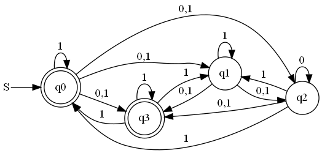

# Introduction

It is a tool about finite automaton.

You can use it for

 - converting -NFA to NFA or NFA to DFA

 - drawing the corresponding pictures.

# Exhibition

-NFA to NFA

to

NFA to DFA:

to

